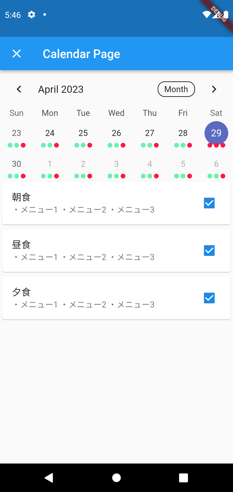
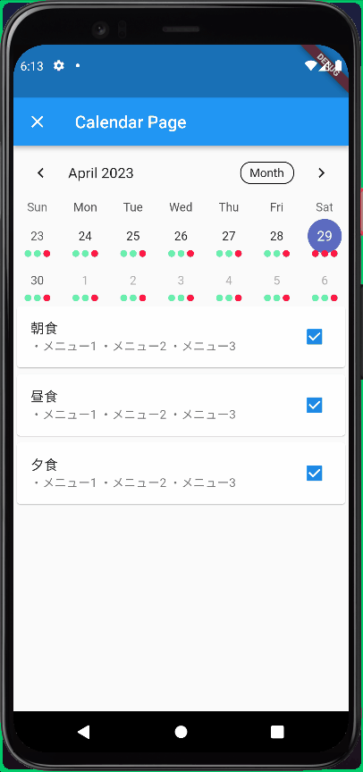

<!-- 
class: title
 -->

# 食いっぱぐれを防ぐアプリを作ろう

### これはただの寮生の欠食管理ではありません

Presened by Hengnieer

---
<!-- 
class: slides
 -->

# Hengineer(へんじにあ)

## 基本情報

- 明石工業高等専門学校（5年もある学校）
- 電気情報工学科 3年生
- Twitter: [@tim_daik](https://twitter.com/tim_daik)
- GitHub: [@hengin-eer](https://github.com/hengin-eer)
- 住まい：**明石高専 学生寮**

---
# 寮生の体を作る寮食

我々は寮の食堂でご飯を食べて生活している

外食や帰省の時など、寮食がいらないときは欠食届を提出する必要がある

寮生には**欠食に関する悩みがいくつかある**

---
# 寮生の悩み

欠食に関する悩みはいくつかある

- 欠食する週の火曜日までには欠食届を出さないといけない
- 食堂に行ってから「**あれ、今日のお昼欠食してたっけ**」なんてことが起こる
  - 寮食を誤って欠食してしまったら、最悪の場合ガチで欠食する（何も食べない）
- 紙に記入しているため、**記入すべき情報が多くて面倒くさい**

---
# 食堂のおばちゃんの負担

**MAX 236人**の寮生の欠食情報をいちいち紙を見て確認している

また字が汚い・複数枚提出している場合もあるため、ヒューマンエラーもしばしば

➡️ **欠食していないのに寮食を食べるための札が無い**なんてことも

私だったら絶対にやりたくない作業をしてくださっている。いつもお世話になっているので負担を減らしたい

---
# フードロス問題

適切に欠食しないとお金がもったいないだけでなくフードロスになる

➡️ **確実に欠食できればフードロスの削減に貢献できる**

最近、寮食で主菜をAセット・Bセットから選べるようになった

➡️ 明らかに人数分より多く用意されているため、**事前にA・Bセットを選べればフードロス削減に貢献**

---

# 問題を解決してくれるのが...!

# 寮生もぐもぐチェッカー

---
# 寮生もぐもぐチェッカーとは？

**寮生が食事を欠食しているかどうか確認・いつでもどこからでも欠食することができる**、寮生泣かせのアプリ

## 主な機能

- 今期1年間の欠食確認
- 今期1年間の欠食申請
- 今月のメニュー確認
- 寮食堂への目安箱 etc..

---
# 寮生もぐもぐチェッカーの強み

- **直感的に分かりやすいUI**
1. 欠食したい日時を選択
2. 欠食するご飯にチェックを入れれば欠食完了
3. （間違って押してもすぐ取り消せるため問題ない）
- **いつでも、どこでも。**
  - インターネットが飛び交っている現代社会では好きな場所、好きなところで欠食できる

---
# 続き

- **欠食している学生の把握が楽ちん**
  - 集計した学生たちの欠食情報を一覧できるため、**食堂のおばちゃんの負担がダダ下がり**
- **必要な機能がオールインワン**
  - 欠食するだけでなく、メニューの確認、A・Bセットの選択、食堂へのフィードバックも全部これ一本
- **フードロス削減に貢献**
  - 適切に欠食を行えるためフードロス削減に貢献できる
  - これには食堂のおばちゃんもにっこり

---
<!-- class: title -->
## ご清聴ありがとうございました
## Thank you for listening
## 谢谢你的关注。
## 잘 들어주셔서 감사합니다.