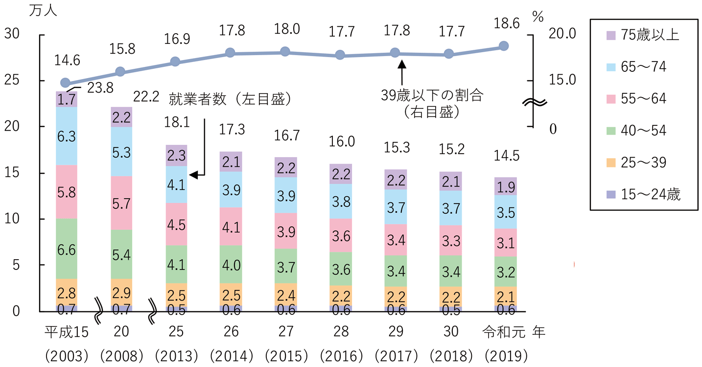

<!-- 
class: title
 -->

## Co+work6班 × 未利用魚

# 未利用魚を魅了魚に計画

### **未利用魚を利用して地元、ひいては日本中の浜を盛り上げろ！！**

---

<!-- 
class: slides
 -->

# そもそも未利用魚とは？

漁獲されても利用されずに捨てられてしまう魚たち

---
<!-- 
class: image-column
 -->

# 活動の目的：未利用魚の利用を推進する

未利用魚の推進をする理由

1. 水産資源を大切にする
2. 漁業従事者の所得向上
3. 漁業に関心を持ってもらう

---

## 水産資源を大切にする

  - イメージや漁獲量、毒針があることで捨てられる魚がいる
  - 近年の乱獲・気候変動により不漁が続き、魚の値段が上がっている
  - **未利用魚の消費が増えれば特定の魚種の消費を抑えられ、分散できる**
  - 参考：https://natures.natureservice.jp/2021/10/23/10536/

---

## 漁業従事者の所得向上

  - 令和4年度の漁師さんの平均年収
    - 沖合漁業の場合：400万~500万
    - 沿岸漁業の場合：200万~300万
  - 漁獲するものによって差はあるが沿岸漁業では日本人の平均年収を下回っている
  - **天候や漁獲高におおきく左右されるため不安定**
  - ➡️未利用魚をお金に換えることが出来ればしたい
  - 参考：https://careergarden.jp/ryoushi/salary/

---

## 漁業に関心を持ってもらう
  - 近年の漁業従事者は減少の一途をたどっている
  - 食糧問題に直結するため深刻である
  - しかし**近年、遠洋漁業の漁師になりたい若者が急増している**
    - 1年目から年収500万
  - 参考
    - https://news.yahoo.co.jp/articles/e46b7dd67e44a38c4a5a171d4919d069df82b5a3
    - https://www.jfa.maff.go.jp/j/kikaku/wpaper/r02_h/trend/1/t1_2_3.html

---

# 未利用魚は何故利用されない？

- 見た目や名前のイメージ
  - 見た目が美味しそうでない、名前のイメージが悪い：サメなど
- 身が柔らかい
  - デメリットであるが、メリットでもある：子供やご老人向けにPR
- **処理が面倒くさい**
  - 毒針がある
    - 毒針があるが除去して食べてみると案外おいしい魚が多い：オコゼ、ゴンズイ
  - 臭み
    - 最大の課題であると考える。臭み消しのための処理方法・レシピを考える
  - 骨が多い
    - これも大きな課題。調理方法を調査・考える

----

# 未利用魚の推進のためのイベント

1. 未利用魚について知る
2. 未利用魚を処理して販売
3. 未利用魚を使った料理の提供
4. 【未定】みんなで楽しめるイベント（例：おさかなクイズ大会

---

## イベントの概要

## 未利用魚について知る

- 生態についての説明
  - スライドやポスター
- 魚を見せる
  - 死んだ魚、写真、絵、ARで魚を表示？

---

# 必要なこと

- 明石浦漁業組合さんのご協力
  - 未利用魚を準備して頂く
  - 
- 私たちの準備
  - イベントの企画
  - イベントの告知
- どちらが準備するか未定
  - 魚を泳がせる水槽

---

# さかな

- 漁師さんへの負担にならないか
  - 漁業に疲れているため休息をとりたい
- やること幼稚すぎないか？夏休みの研究？
  - 他高専の活動を見ているのか？
  - 企業を巻き込んで高専の知見・技術を活かせてないでしょ
  - DCONとか
- 未利用魚の定義

xxxxx

---

# Mermaidのデモ

flowchart TD
    A[Start] --> B{Is it?}
    B -->|Yes| C[OK]
    C --> D[Rethink]
    D --> B
    B ---->|No| E[End]

<!-- import mermaid -->

